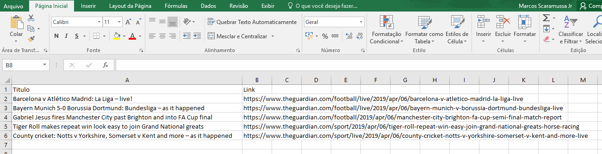

# news-theguardian

Um script modularizado para buscar, através da API do Jornal The Guardian, as últimas notícias e exportar para CSV os títulos e links dessas notícias em somente algumas categorias:

- News
- Sports
- Arts

API Utilizada: [OPEN-PLATAFORM.THEGUARDIAN.COM] (http://open-platform.theguardian.com)

# Funções
```sh
exportar_csv(titulo, link, nome)
buscar_noticias(dados)
buscar_sports(dados)
buscar_news(dados)
buscar_arts(dados)
```

# Execução
> Pré-Requisito: Ter o GIT e o Python 3 instalados
```sh
$ git clone https://github.com/scaramuzza/news-theguardian.git
$ cd news-theguardian
$ pip install requests
$ pip install pandas
$ pip install json
$ python exercicio1-the-guardian3.py
```

# Comandos do GIT
```sh
$ git status
$ git add .
$ git commit -k "Nomenclatura das alterações"
$ git pull --rebase origin master
$ git push origin master
```

# Arquivo gerado


# Desenvolvedor

- Marcos Scaramussa Jr

# Licença

- Software Livre (Free Software) hhhhh
